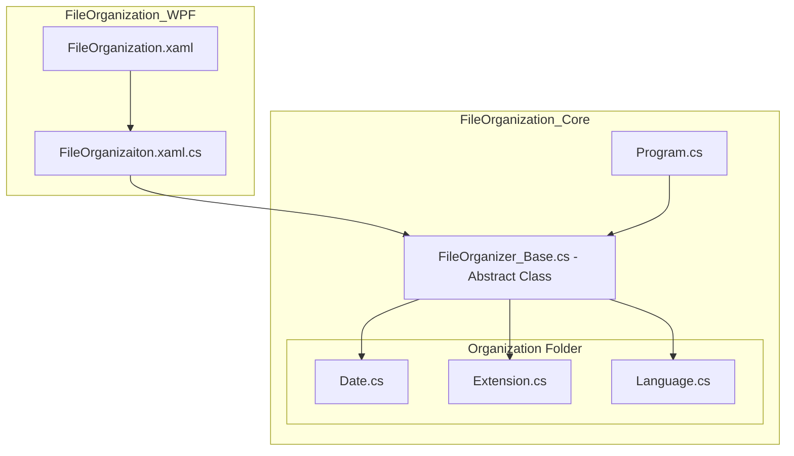

# File-Organizer
### 1. 프로젝트 설명
<b>FileOrganizer는 확장자, 날짜 그리고 파일명 언어에 따라 폴더 내 파일을 자동으로 정리하는 프로그램입니다.</b>  
 
<b>시연 영상:</b> https://youtu.be/7ctBmCC3JPA   
레포지토리 내 zip를 다운로드 후 <b>FileOrganization_Core.exe</b> 혹은 <b>FileOrganization_WPF.exe</b>로 실행할 수 있습니다. 
Core.exe는 콘솔로만 입출력이 이루어지고, WPF.exe는 윈도우 UI 프로그램으로 인터렉션이 가능합니다. 
 
 

## 2. 프로젝트 기능
### 1) 확장명에 따른 분류 - [해당 코드](https://github.com/YGY515/File-Organizer/blob/main/FileOrganization_Core/Organization/Extension.cs)
 
정리 옵션을 확장자로 선택 시, 파일의 확장자에 따라 폴더를 생성하고 파일을 이동시킵니다. 
 

### 2) 날짜에 따른 분류 - [해당 코드](https://github.com/YGY515/File-Organizer/blob/main/FileOrganization_Core/Organization/Date.cs)
 
정리 옵션을 날짜(YYYY-MM)으로 선택 시, 파일의 수정 시간을 기준으로 폴더를 생성하고 파일을 분류합니다. 
 

### 3) 파일명 언어에 따른 분류 - [해당 코드](https://github.com/YGY515/File-Organizer/blob/main/FileOrganization_Core/Organization/Language.cs)
 
정리 옵션을 파일명 언어로 선택 시, 파일의 글자가 한글이면 Korean 영어면 English 폴더로 분류합니다. 
 
 

## 3. 프로젝트 구조

### 1) FileOrganization_Core

<b>파일 정리의 핵심 로직을 담당하는 콘솔 기반 프로그램입니다.</b> 
사용자가 입력한 폴더 경로와 정리 기준을 바탕으로 파일을 분석하고, 기준에 따라 폴더를 생성한 뒤 파일을 이동시킵니다. 

FileOrganizer_Base 추상 클래스를 중심으로 공통적인 파일 정리 기능을 정의하고, 
Organization 폴더의 각 클래스에서 정리 기준에 따른 세부 내용을 구현했습니다.

이를 통해 정리 기준이 추가되더라도 새로운 클래스를 작성하여 쉽게 확장할 수 있도록 설계했습니다. 
 
### 2) FileOrganization_WPF

<b>Core의 기능을 손쉽게 Windows GUI 환경에서 사용할 수 있도록 확장한 프로그램입니다.</b>

* 폴더 선택
* 정리 기준 선택(라디오 버튼)
* 정리 결과 확인
* 정리된 폴더 탐색기 열기

등의 UI를 제공하며, 실제 프로그램 로직은 FileOrganization_Core의 클래스를 그대로 호출하여 사용합니다. 
