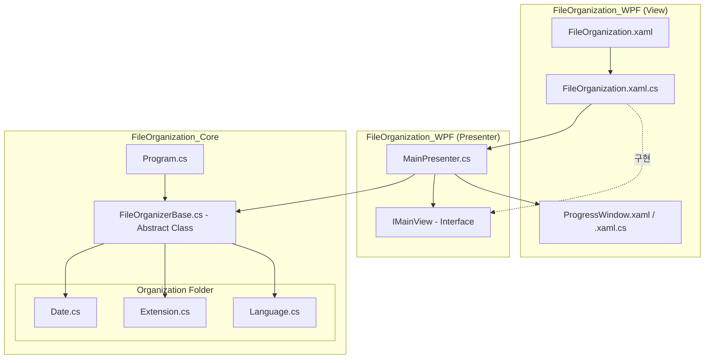

# File-Organizer

### 1. 프로젝트 설명 🚩
 
<b>FileOrganizer는 확장자, 날짜, 파일명 언어에 따라 폴더 내 파일을 자동으로 정리하는 프로그램입니다.</b>  
FileOrganizer_v2.0.zip을 다운로드 후 <b>FileOrganization_Core.exe</b> 혹은 <b>FileOrganization_WPF.exe</b>으로 실행할 수 있습니다. 
* Core.exe는 콘솔로만 입출력이 이루어지고, WPF.exe는 윈도우 UI 프로그램으로 인터렉션이 가능합니다. 
 

**v2.0 업데이트:** 멀티스레딩 도입으로 대용량 파일 처리 속도 개선, 여러 폴더 동시 처리, 작업 취소 및 복구, 실시간 진행률 표시, MVP 아키텍처 리팩토링을 적용했습니다. (자세한 내용은 4번 항목 참고)
 
 

## 2. 프로젝트 기능 ✏️
### 1) 확장명에 따른 분류 - [해당 코드](https://github.com/YGY515/File-Organizer/blob/main/FileOrganization_Core/Organization/Extension.cs)
 
정리 옵션을 확장자로 선택 시, 파일의 확장자에 따라 폴더를 생성하고 파일을 이동시킵니다. 
 

### 2) 날짜에 따른 분류 - [해당 코드](https://github.com/YGY515/File-Organizer/blob/main/FileOrganization_Core/Organization/Date.cs)
 
정리 옵션을 날짜(YYYY-MM)으로 선택 시, 파일의 수정 시간을 기준으로 폴더를 생성하고 파일을 분류합니다. 
 

### 3) 파일명 언어에 따른 분류 - [해당 코드](https://github.com/YGY515/File-Organizer/blob/main/FileOrganization_Core/Organization/Language.cs)
 
정리 옵션을 파일명 언어로 선택 시, 파일의 글자가 한글이면 Korean 영어면 English 폴더로 분류합니다. 
 

### 4) 여러 폴더 동시 정리
입력한 경로 하위에 여러 폴더가 있을 경우, 폴더마다 독립적으로 정리 작업을 병렬 수행합니다. 
 

### 5) 작업 취소 및 자동 복구
정리 도중 취소를 요청하면 진행 중인 작업이 즉시 중단되고, 이미 이동된 파일은 원래 위치로 자동 복구됩니다. 
 

### 6) 실시간 진행률 표시
 
콘솔에서는 텍스트로, WPF에서는 프로그레스 바와 별도 창으로 전체 작업 진행률을 실시간으로 확인할 수 있습니다. 
 
 

## 3. 프로젝트 구조 📂

```mermaid
graph TD
    subgraph "FileOrganization_WPF (View)"
        XAML[FileOrganization.xaml]
        CS[FileOrganization.xaml.cs]
        PW[ProgressWindow.xaml / .xaml.cs]
    end

    subgraph "FileOrganization_WPF (Presenter)"
        IView[IMainView - Interface]
        Presenter[MainPresenter.cs]
    end

    subgraph "FileOrganization_Core"
        Prog[Program.cs]
        Base[FileOrganizerBase.cs - Abstract Class]

        subgraph "Organization Folder"
            Date[Date.cs]
            Ext[Extension.cs]
            Lang[Language.cs]
        end
    end

    XAML --> CS
    CS -.구현.-> IView
    CS --> Presenter
    Presenter --> PW
    Presenter --> IView
    Presenter --> Base

    Prog --> Base

    Base --> Date
    Base --> Ext
    Base --> Lang
```

### 1) FileOrganization_Core
파일 정리의 핵심 로직을 담당하는 콘솔 기반 프로그램입니다. 
사용자가 입력한 폴더 경로와 정리 기준을 바탕으로 파일을 분석하고, 기준에 따라 폴더를 생성한 뒤 파일을 이동시킵니다. 

FileOrganizerBase 추상 클래스를 중심으로 공통적인 파일 정리 기능을 정의하고, 
Organization 폴더의 각 클래스에서 정리 기준에 따른 세부 내용을 구현했습니다. 

정리 기준이 추가되더라도 새로운 클래스를 작성하여 쉽게 <b>확장</b>할 수 있도록 설계했습니다. 
 

### 2) FileOrganization_WPF
Core의 기능을 손쉽게 Windows GUI 환경에서 사용할 수 있도록 확장한 프로그램입니다.

* 폴더 선택
* 정리 기준 선택(라디오 버튼)
* 정리 진행률 표시 및 취소
* 정리 결과 확인
* 정리된 폴더 탐색기 열기

**MVP(Model-View-Presenter) 패턴을 적용**하여, View(`xaml.cs`)는 Core 로직을 전혀 알지 못하고 `IMainView` 인터페이스를 통해서만 Presenter와 소통합니다. Presenter(`MainPresenter.cs`)가 어떤 정리 기준을 쓸지 판단하고 Core를 직접 호출하는 역할을 전담합니다. 

이를 통해 View와 핵심 로직을 분리하고, UI 없이도 Presenter의 판단 로직을 테스트할 수 있는 구조로 개선했습니다. 
 
 

## 4. 개선 사항 및 문제 해결 경험 🚨

### 1) 디스크 I/O 중복 제거 (리스트 캐싱)
기존에는 `CollectFiles()`와 `MoveFiles()`에서 각각 `Directory.GetFiles()`를 호출해, 같은 폴더를 디스크에서 두 번 읽고 있었습니다. 
파일 목록을 `List<string>`에 한 번만 캐싱해 재사용하도록 하여 디스크 접근 횟수를 절반으로 줄였습니다.

  
### 2) 파일 이동 병렬화 (Parallel.ForEach + SemaphoreSlim)
파일이 수십만 개인 상황에서도 프로그램이 멈추지 않도록, 파일 이동 로직을 `Parallel.ForEach`로 병렬화했습니다. 
다만 파일 수백 개가 한꺼번에 디스크 I/O를 시도하면 오히려 성능이 저하될 수 있어, `SemaphoreSlim`으로 동시 이동 개수를 4개로 제한했습니다.

> **문제 해결:** 병렬화 과정에서 `HashSet<string>`과 `count` 변수가 스레드 안전하지 않아 결과값이 누락되는 문제가 있었습니다. 파일 수집 단계는 순차 처리를 유지하고, 병렬화가 필요한 카운터는 `lock` 또는 `Interlocked.Increment`로 교체해 해결했습니다.

  
### 3) 여러 폴더 동시 처리
입력 경로 하위의 모든 폴더를 `Directory.GetDirectories()`로 수집하고, 폴더별로 병렬 정리가 가능하도록 확장했습니다.
> **문제 해결:** 초기에는 정리 인스턴스(`FileOrganizerBase`)를 폴더마다 재사용해, 여러 스레드가 같은 인스턴스의 `_path`, `files` 같은 필드를 동시에 덮어써 정리 결과가 뒤섞이는 버그가 발생했습니다. 폴더마다 새 인스턴스를 생성하도록 수정해 스레드 간 상태 공유 문제를 해결했습니다.

  
### 4) 작업 취소 및 자동 복구
`CancellationToken`을 도입해 사용자가 언제든 정리 작업을 취소할 수 있도록 했습니다. 
파일을 이동할 때마다 `(원본 경로, 이동 경로)`를 기록해두고, 취소 시 이 기록을 역순으로 되짚어 파일을 원래 위치로 복구합니다.
> **문제 해결:** 폴더 단위 병렬 반복문(`Parallel.ForEach`)에 취소 토큰을 물려주지 않으면, 내부에서 발생한 `OperationCanceledException`이 `AggregateException`으로 감싸져 상위 `catch` 블록에서 잡히지 않는 문제가 있었습니다. 모든 병렬 반복문에 동일한 `CancellationToken`을 일관되게 전달해 해결했습니다.

  
### 5) 실시간 진행률 표시
`IProgress<int>`를 통해 콘솔과 WPF 양쪽에 실시간 진행률을 전달하도록 구현했습니다.
> **문제 해결:** 콘솔 환경에서는 `Progress<T>`가 콜백을 스레드 풀 큐에 위임하는데, 병렬 작업이 스레드 풀을 모두 점유하고 있으면 진행률 출력이 밀려 화면에 표시되지 않는 문제가 있었습니다. 콜백을 호출 스레드에서 즉시 실행하는 별도 구현으로 교체해 해결했습니다. 또한 WPF에서는 취소 이후에도 큐에 남아있던 진행률 리포트가 뒤늦게 실행되어 "취소" 문구가 다시 "100% 완료"로 덮어써지는 문제가 있었는데, 콜백 내부에서 취소 여부를 확인해 무시하도록 처리했습니다.

  
### 6) MVP 아키텍처 리팩토링
기존 `xaml.cs`가 UI 이벤트 처리, 정리 기준 판단, Core 로직 호출을 모두 담당하고 있어 UI 없이는 로직을 테스트할 수 없는 구조였습니다. 
`IMainView` 인터페이스와 `MainPresenter`를 도입해 View와 핵심 로직을 분리했습니다.
> **문제 해결:** Presenter에서 만든 백그라운드 스레드(`Task.Run`) 안에서 라디오 버튼(`IsChecked`) 같은 UI 요소에 직접 접근하면서 크로스 스레드 예외가 발생했습니다. UI 스레드에 있을 때 필요한 값을 미리 지역 변수로 캡처해두고, 백그라운드 스레드에서는 그 값만 참조하도록 수정해 해결했습니다.  

  
## 5. 향후 계획 📌
- 정리 완료 기록을 서버와 DB에 연동하여 이력 조회 기능 추가 예정

 
